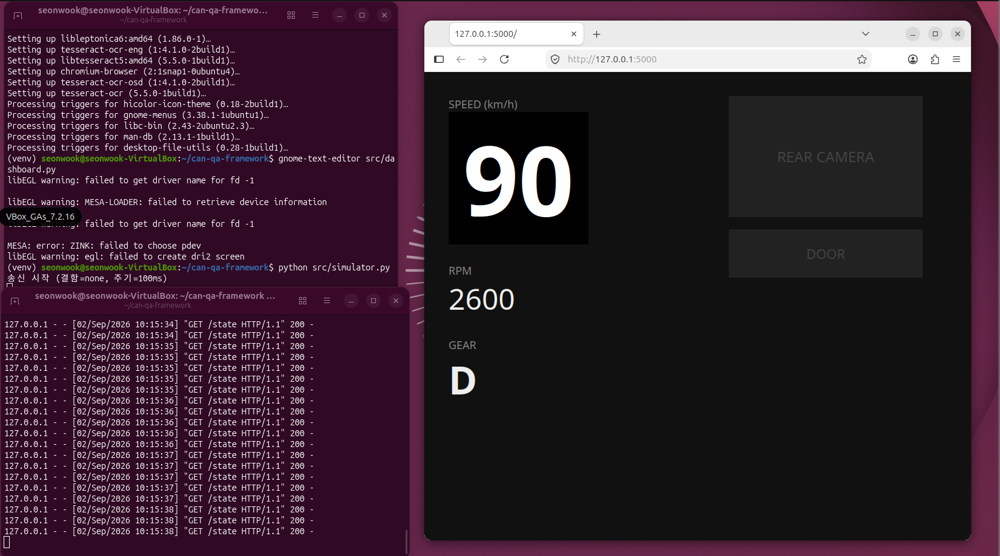
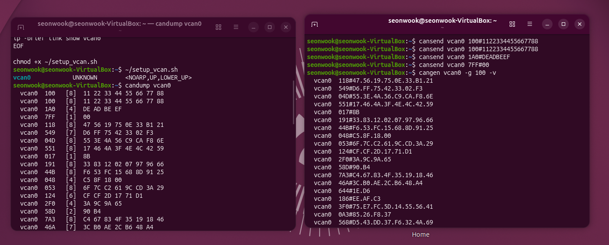
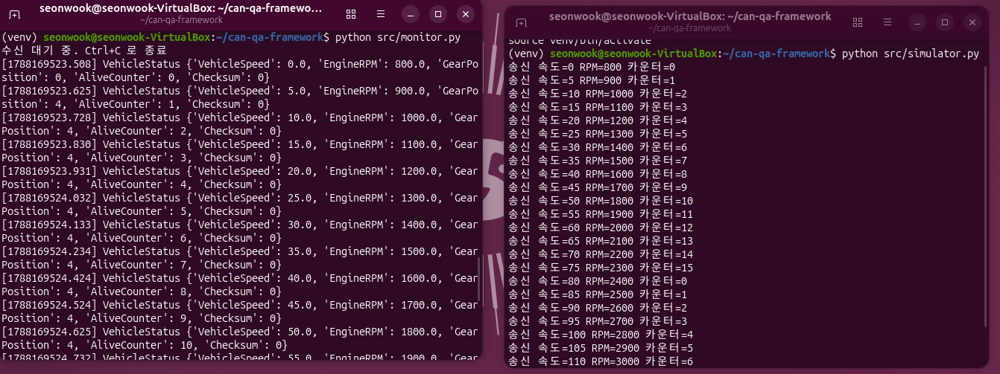
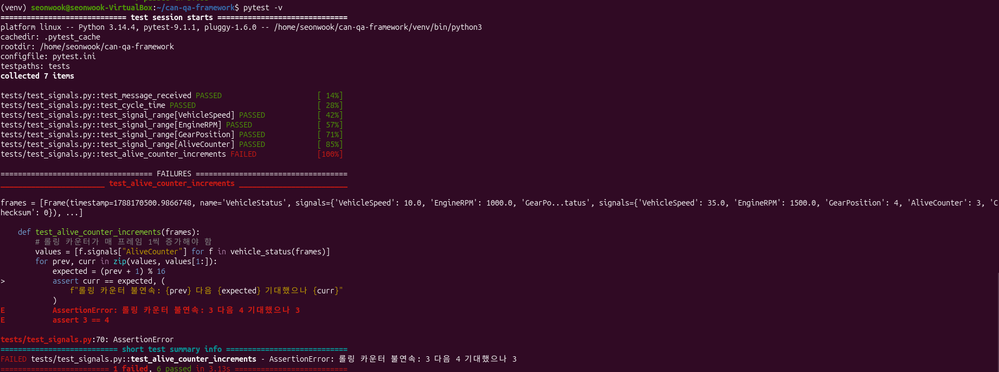
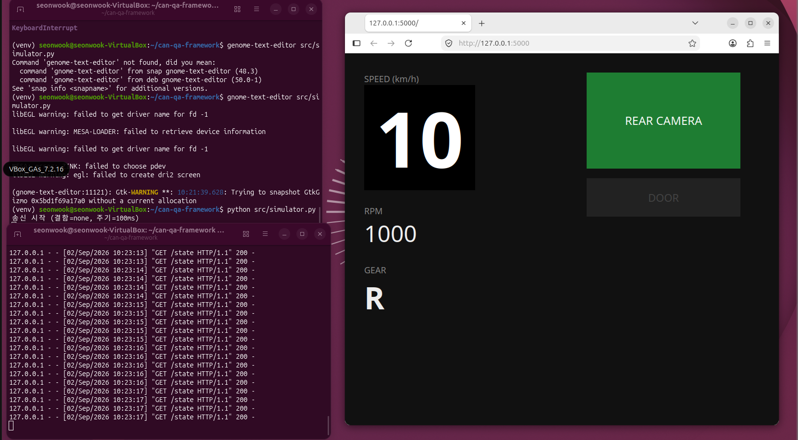
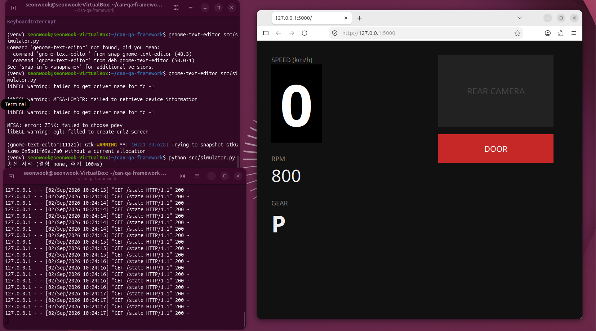
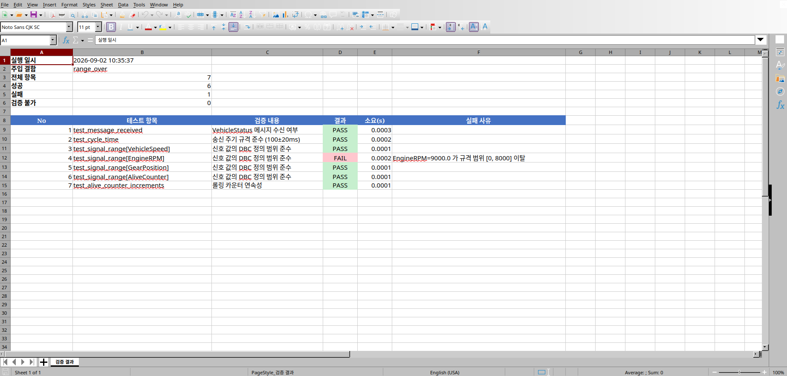

# CAN QA Framework

- 차량 내 ECU 간 통신 프로토콜인 CAN의 신호 정합성을 자동 검증하는 테스트 프레임워크입니다. DBC 명세를 기준으로 가상 ECU가 송신한 신호의 주기와 값 범위를 판정하고 해당 신호가 IVI 애플리케이션에 정확히 반영되는지까지 검증한 뒤 결과를 엑셀 리포트로 생성합니다.

- 실제 차량이나 CAN 인터페이스 장비 없이 리눅스 SocketCAN의 가상 인터페이스 위에 검증 환경 전체를 구성했습니다. 신호를 보내는 ECU와 그것을 받는 IVI를 모두 소프트웨어로 구현하고 그 사이에 검증 계층을 두는 구조입니다. 버스 연결부를 별도 계층으로 분리하여 채널 설정 변경만으로 실제 CAN 하드웨어에 연결됩니다.



## 기술 스택

**통신 / 명세** SocketCAN(vcan) · python-can · cantools(DBC)

**검증 엔진** pytest · 결함 주입 기반 유효성 검증

**IVI 시뮬레이션 / 리포트** Flask · openpyxl

## 주요 기능

- **DBC 기반 신호 검증** : 판정 기준을 코드가 아닌 명세 파일에서 조회하여 스펙 변경 시 테스트 수정 불필요
- **가상 ECU 시뮬레이터** : 차속·RPM·기어·도어 신호를 규격 주기로 송신하는 레스트버스 시뮬레이션
- **결함 주입 5종** : 롤링 카운터 고정 · 신호 범위 초과 · 주기 지연 · 메시지 미전송 · 정상
- **이중 검증 계층** : 신호 레벨 검증과 애플리케이션 반영 검증을 분리하여 결함 위치 식별
- **IVI 대시보드** : CAN 수신 값을 실시간 표시하는 검증 대상 애플리케이션
- **검증 불가 구분** : 실패(FAIL)와 데이터 부재로 인한 실행 불가(SKIP)를 분리 기록
- **일괄 조건 검증** : 명령 한 번으로 결함 5종을 순회하며 조건별 리포트 생성
- **엑셀 리포트** : 주입 결함 조건과 항목별 판정 및 실패 사유를 자동 문서화

## 아키텍처

- 검증 대상(SUT)과 검증 주체를 완전히 분리했습니다.
- 시뮬레이터와 테스트는 별도 프로세스로 실행되며 내부 상태를 공유하지 않고 오직 CAN 버스를 통해서만 상호작용합니다.
- 양쪽 모두 동일한 DBC를 참조하므로 판정 기준이 검증 대상 외부에 존재합니다. 테스트 코드에 임계값을 하드코딩하지 않고 명세에서 읽어오는 구조입니다.
- 버스 연결을 `collector.py`와 `injector.py`로 격리하여 vcan0을 물리 채널로 교체할 때 나머지 코드는 수정되지 않습니다.

```
[가상 ECU 시뮬레이터: simulator.py]
         │  --fault 옵션으로 결함 주입
         │
         ▼ CAN 프레임 송신
 ─────────────────────────── vcan0 (SocketCAN)
         │
    ┌────┴────────────────────┐
    │                         │
    ▼                         ▼
[수집기: collector.py]   [IVI 대시보드: dashboard.py]
    │                         │
    │ 디코딩된 프레임 목록      │ 수신 신호를 화면에 표시
    ▼                         ▼
[신호 검증: test_signals.py]  [반영 검증: test_ivi.py]
    │  · 메시지 수신           │  · 주입 값의 표시 일치
    │  · 주기 준수             │  · 기어 상태 반영
    │  · 신호 범위             │  · 도어 상태 반영
    │  · 롤링 카운터 연속성     │
    └────────────┬────────────┘
                 │
                 ▼ pytest 훅으로 결과 수집
        [리포트 생성기: conftest.py]
                 │
                 └─► reports/ 폴더에 조건별 엑셀 출력

        [DBC 명세: vehicle.dbc] ◄── 시뮬레이터와 검증부가 공통 참조
```

**시뮬레이터 계층**
- DBC에 정의된 신호를 실제 단위로 지정하면 명세에 따라 바이트로 인코딩되어 송신됩니다. 결함 주입 옵션에 따라 의도적으로 규격을 위반한 신호를 생성합니다.

**검증 계층**
- 지정 시간 동안 버스를 수집한 뒤 DBC로 디코딩하여 판정합니다. 유효 범위는 테스트 코드가 아닌 DBC의 minimum과 maximum에서 조회합니다.

**IVI 계층**
- CAN 수신을 별도 스레드로 처리하며 최신 신호 상태를 유지합니다. 검증 시에는 이 상태를 조회하여 주입 값과 대조합니다.

- 가상 인터페이스는 표준 CAN 도구와 동일하게 동작합니다. 송신 노드와 수신 노드는 서로를 알지 못한 채 버스만으로 만나며 이는 CAN의 브로드캐스트 특성을 그대로 재현합니다.



## DBC 명세

- 검증 기준이 되는 신호 정의입니다. 요구사항 명세서 역할을 하며 테스트 케이스의 근거가 됩니다.

```
BO_ 256 VehicleStatus: 8 GATEWAY
 SG_ VehicleSpeed : 0|16@1+ (0.1,0) [0|255] "km/h" IVI
 SG_ EngineRPM : 16|16@1+ (0.25,0) [0|8000] "rpm" IVI
 SG_ GearPosition : 32|4@1+ (1,0) [0|8] "" IVI
 SG_ AliveCounter : 48|4@1+ (1,0) [0|15] "" IVI
 SG_ Checksum : 56|8@1+ (1,0) [0|255] "" IVI
```

| 항목 | 설명 |
|---|---|
| `256` | 메시지 ID. 10진수 표기이며 0x100에 해당 |
| `0\|16` | 신호가 사용하는 시작 비트와 길이 |
| `@1+` | 리틀엔디안, 부호 없음 |
| `(0.1,0)` | 스케일과 오프셋. 실제값 = 원시값 × 0.1 |
| `[0\|255]` | 유효 범위. **신호 범위 테스트의 판정 기준** |
| `AliveCounter` | 롤링 카운터. 값이 정상이나 통신이 정지한 상태를 검출 |

- 명세 적용 전에는 수신 측이 원시 바이트만 확인할 수 있습니다. 차속 120은 `04 B0`으로 전송되며 이 값이 무엇을 의미하는지는 프로토콜이 알려주지 않습니다.


- DBC를 적용하면 동일한 프레임이 신호 이름과 실제 단위로 해석됩니다. 인코딩 규칙이 코드에서 명세로 분리되어 검증 기준이 검증 대상 외부에 위치하게 됩니다.



## 검증 항목

| 계층 | 항목 | 검증 내용 |
|---|---|---|
| 신호 | 메시지 수신 | 규격 메시지가 버스에 존재하는가 |
| 신호 | 주기 준수 | 송신 간격이 100±20ms 범위인가 |
| 신호 | 신호 범위 | 값이 DBC 정의 범위를 벗어나지 않는가 |
| 신호 | 롤링 카운터 | 매 프레임 1씩 증가하며 순환하는가 |
| IVI | 차속 반영 | 주입한 차속이 화면 상태에 일치하는가 |
| IVI | 기어 반영 | 후진 기어 진입이 반영되는가 |
| IVI | 도어 반영 | 개방과 폐쇄가 각각 반영되는가 |

## 결함 주입 검증

- 테스트가 통과한다는 결과만으로는 그 테스트가 실제로 검증을 수행하는지 알 수 없습니다. 조건을 잘못 작성한 테스트는 아무것도 확인하지 않은 채 통과하기도 합니다.
- 따라서 답을 아는 결함을 의도적으로 주입하여 검출 여부를 확인했습니다. 각 결함이 대응하는 테스트에서만 검출되고 무관한 항목은 정상 통과하는 것이 확인 기준입니다.

| 주입 결함 | 방식 | 검출 항목 | 실측 결과 |
|---|---|---|---|
| 정상 | - | - | 7 passed |
| 롤링 카운터 고정 | AliveCounter 3으로 고정 | 카운터 연속성 | 3 다음 3 수신 |
| 신호 범위 초과 | EngineRPM 9000 주입 | 신호 범위 | 규격 [0, 8000] 이탈 |
| 주기 지연 | 송신 주기 100→300ms | 주기 준수 | 평균 297.0ms |
| 메시지 미전송 | 송신 중단 | 메시지 수신 | 프레임 0건, 나머지 SKIP |

- 롤링 카운터 고정 결함 주입 시 해당 항목만 실패하고 나머지 6개는 정상 통과합니다. 실패 메시지에 기대값과 실제값이 함께 기록되어 원인 파악이 가능합니다.



## IVI 반영 검증

- CAN으로 주입한 신호가 IVI 애플리케이션에 정확히 전달되고 해석되는지 검증합니다.
- 후진 기어 진입 시 후방 카메라 영역이 활성화됩니다.



- 정차 상태에서 도어 개방 신호 수신 시 경고가 표시됩니다.



## 검증 리포트

- 검증 종료 시 pytest 훅이 결과를 수집하여 엑셀 리포트를 생성합니다.
- 상단 요약에 실행 일시와 주입 결함 조건 및 성공·실패·검증 불가 건수를 기록하고 하단 표에 항목별 판정과 실패 사유를 남깁니다.
- 어떤 조건에서 실행한 결과인지가 함께 기록되지 않으면 리포트만으로 원인을 추적할 수 없으므로 주입 조건을 파일명과 본문에 모두 반영했습니다.



## 설치 및 실행

가상 CAN 인터페이스를 활성화합니다. 재부팅 시 초기화되므로 매 세션 실행이 필요합니다.

```bash
./scripts/setup_vcan.sh
```

의존성을 설치합니다.

```bash
python3 -m venv venv
source venv/bin/activate
pip install -r requirements.txt
```

## 사용 방법

**전체 조건 일괄 검증**

결함 5종을 순회하며 시뮬레이터 기동과 검증을 자동 수행합니다.

```bash
python scripts/run_all.py
```

**개별 조건 검증**

```bash
# 터미널 1 - 시뮬레이터 기동
python src/simulator.py --fault counter_stuck

# 터미널 2 - 검증 실행
pytest -v --fault counter_stuck
```

**IVI 반영 검증**

```bash
# 터미널 1 - 대시보드 기동 후 브라우저에서 127.0.0.1:5000 접속
python src/dashboard.py

# 터미널 2 - 검증 실행
pytest tests/test_ivi.py -v
```

완료 후 `reports/` 폴더에 조건별 엑셀 리포트가 생성됩니다.

## 트러블 슈팅

**결함 주입 시 테스트 간 간섭이 발생하는 문제**

- 신호 범위 초과 결함을 주입했을 때 무관한 주기 검증 테스트까지 실패했습니다. 확인 결과 범위를 벗어난 값의 인코딩에서 예외가 발생하고 이를 포착해 재시도하는 과정에서 송신 타이밍이 밀린 것이 원인이었습니다.
- 결함 하나가 다른 특성까지 오염시키면 리포트만으로 실제 결함 위치를 식별할 수 없습니다.

**해결 조치**
- 예외가 발생하지 않는 인코딩 방식으로 변경하여 송신 주기를 유지했습니다. 이후 각 결함이 대응하는 테스트에서만 검출됩니다.

**주기 검증이 간헐적으로 실패하는 문제**

- 동일한 정상 조건에서 주기 테스트가 통과와 실패를 반복했습니다. 실측값이 121~125ms로 허용 범위 경계에 걸쳐 있었습니다.
- 원인은 `sleep`이 지정 시간 이상의 대기만 보장할 뿐 정확한 간격을 보장하지 않으며 여기에 인코딩과 송신 처리 시간이 매 주기 누적된 것이었습니다.

**해결 조치**
- 목표 시각을 기준으로 대기 시간을 계산하는 방식으로 변경하여 처리 시간이 누적되지 않도록 했습니다. 허용 오차를 넓혀 통과시키는 방법도 가능했으나 이는 검증 기준을 완화해 문제를 은폐하는 것이므로 채택하지 않았습니다.

**검증 실패와 검증 불가가 구분되지 않는 문제**

- 메시지 미전송 조건에서 7개 항목이 모두 오류로 처리되었습니다. 그러나 실제 문제는 메시지 미수신 1건이며 나머지는 판정할 데이터가 없어 실행되지 못한 것입니다.
- 모든 항목이 실패로 기록되면 원인 분석 시 무엇이 실제 결함인지 식별할 수 없습니다.

**해결 조치**
- 데이터 부재 시 SKIP으로 처리하도록 분리하고 리포트에도 별도 상태로 기록했습니다. 미전송 조건에서 실패 1건과 검증 불가 6건으로 구분됩니다.

**가상 환경에서 화면 캡처 도구가 동작하지 않는 문제**

- 화면 픽셀 판정을 계획하였으나 Wayland 세션에서 외부 캡처 도구의 창 접근이 차단되었습니다. Selenium 기반 브라우저 자동화와 xdotool 및 gnome-screenshot을 순차 검토했으나 모두 동일한 제약에 도달했습니다.
- X11 세션 전환이 근본 해결이나 해당 배포판에서 Xorg 세션이 기본 제공되지 않아 추가 구성이 필요한 상황이었습니다.

**해결 조치**
- 검증 목적이 "CAN 신호가 IVI에 정확히 전달되고 해석되는가"임을 기준으로 애플리케이션 상태 조회 방식으로 전환했습니다. 렌더링 결과 자체는 검증 범위에서 제외되며 이 한계는 문서에 명시했습니다.

## 한계 및 확장 방향

**현재 한계**

- 물리 계층 검증 불가. 종단 저항, 버스 부하율, 전기적 노이즈로 인한 오류 프레임은 가상 인터페이스에서 재현되지 않습니다.
- 화면 렌더링 검증 미포함. IVI 검증은 애플리케이션 상태 수준에서 수행됩니다.
- 체크섬 미검증. DBC에 신호는 정의되어 있으나 산출 로직은 미구현 상태입니다.

**확장 방향**

- 체크섬 검증 추가
- 차량 이더넷 및 SOME/IP 대응
- CI 파이프라인 연동을 통한 야간 자동 검증 및 리포트 배포

## 문서

- [CAN 통신 및 QA 이론 정리](docs/theory.md)
